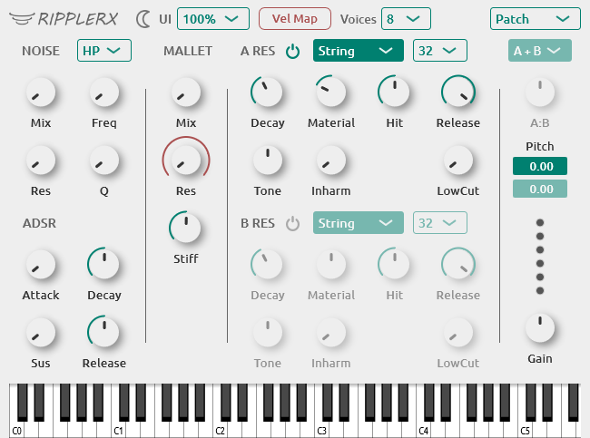

<h1 align="center">
  
  <br>
</h1>
<div align="center">

[](https://github.com/tiagolr/ripplerx/releases)
[](https://github.com/tiagolr/ripplerx/releases)
[](https://github.com/tiagolr/ripplerx/releases)

</div>
<div align="center">

[](https://github.com/tiagolr/ripplerx/releases/latest)


</div>

RipplerX is a physically modeled synth, capable of sounds similar to AAS Chromaphone and Ableton Collision.

<div align="center">



</div>

### Features

  * **Cross-platform** available on Windows, Linux and macOS
  * **Dual resonators** with serial and parallel coupling
  * **9 Models** of acoustic resonators: String, Beam, Squared, Membrane, Drumhead, Plate, Marimba, Open tube and Closed tube.
  * **Inharmocity, Tone, Ratio and Material** sliders to shape the timbre.
  * **Noise and mallet** generators
  * Up to **64 partials** per resonator (configurable).
  * Built with **JUCE**

### Download

The latest version and others can be found on [Github releases](https://github.com/tiagolr/ripplerx/releases)
Current builds include LV2 (Linux), AU (macOS) and VST3 (Windows, Linux and macOS)

### About

RipplerX is a port of [Rippler2](https://github.com/tiagolr/tilr_jsfx?tab=readme-ov-file#rippler-2) for the Reaper DAW, it started as a research project into physically modelled drums and ended up a synth heavily based on AAS Chromaphone and Sai'ke Partials.

**Is RipplerX a Chromaphone ripoff?**

No and yes, the controls and models are heavily based on Chromaphone, almost a one to one copy, with that said this one has additional controls for Inharmonicity and model Ratio for example and a distinct sound. Chromaphone is a more complete synth with more features, it has a more sophisticated mallet generator, a physics based serial coupling, a better UI, to name a few.. if you like this synth you should definetly check it out.

There is value in having an open source alternative to AAS plugins otherwise I would have called it RippoffX, it also provides an entry point for developers or researchers into physical modelling.

**Acknowledgments**

* Saike for the open source Partials synth which the original Rippler was based on.
* AAS for Chromaphone synth and manual with hints about the models and parameters used.
* Other DSP coders like Tale and Scott Stillwell for providing open source JSFXs and libs.

### MacOS

MacOS builds are untested and unsigned, please let me know of any issues by opening a ticket, don't expect a promptly fix as I don't have access to that OS.

### Build

```bash
git clone --recurse-submodules https://github.com/tiagolr/ripplerx.git

# windows
cmake -G "Visual Studio 17 2022" -DCMAKE_BUILD_TYPE=Release -S . -B ./build

# linux
sudo apt update
sudo apt-get install libx11-dev libfreetype-dev libfontconfig1-dev libasound2-dev libxrandr-dev libxinerama-dev libxcursor-dev
cmake -G "Unix Makefiles" -DCMAKE_BUILD_TYPE=Release -S . -B ./build
make --build ./build --config Release

# macOS
cmake -G "Unix Makefiles" -DCMAKE_BUILD_TYPE=Release -DCMAKE_OSX_ARCHITECTURES="x86_64;arm64" -S . -B ./build
cmake --build ./build --config Release
```
